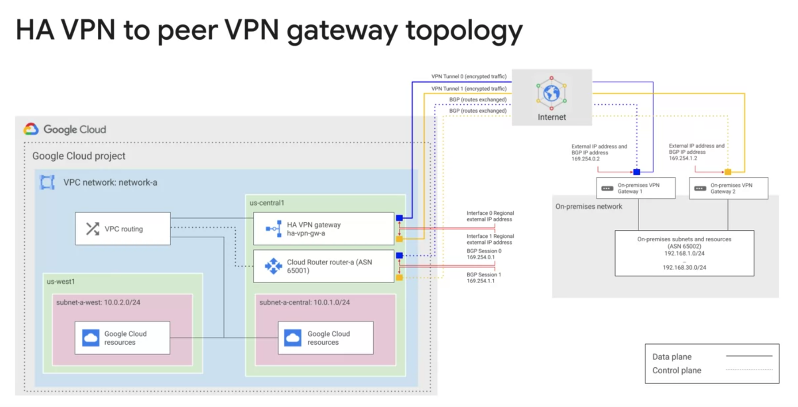

Interconnecting Networks:
=========================

Cloud VPN:
----------

-> Cloud VPN securely connects your on-premises network to your Google cloud VPC network
-> The entire network network is encrypted in one VPN Gateway and decrypted in another VPN gateway
Supports the below:
* Site-to-Site VPN
* Static routes
* Dynamic routes (Cloud Router)
* IKEv1 and IKEv2 Ciphers

HA VPN (High Availability VPN):
-------------------------------
-> Provides 99.99% service availability

-> To Obtain this High availability we must properly configure the two HA VPN tunnels
-> It must use the Dynamic BGP routing

Dynamic routung with Cloud routing:
-----------------------------------
-> Cloud router uses the BGP routing for the cloud VPN to achieve the dynamic routing

Dedicated Interconnect:
-----------------------
-> Connecting over the co-location facility where the GCP Peering edge and On-premise router will connect
-> Enable the BGP session over this interconnect between the GCP cloud router and On premise router
-> In order to enable the dedicated interconnect, our location must support the Google's Colocation facility
-> If our location is no where near to this colocation facility, that's when we need to think about the partner interconnect

Partner interconnect:
---------------------
-> It connects our on-prem network to GCP VPC network through a Supported service provider
-> In order to use we need to work the supported Service provider to connect our VPC network to on prem network
-> It can be configured 99.99% uptime SLA

Cloud Peering:
--------------
1. Direct Peering 
     Direct Peering, also known as public peering or Internet peering, involves the direct exchange of traffic between two networks at an Internet Exchange Point (IXP) or a peering location. It enables networks to exchange data directly without traversing third-party networks or service providers. Direct Peering is typically used by Internet Service Providers (ISPs), content providers, and large networks to improve network performance, reduce latency, and lower transit costs. It allows for efficient and optimized data routing between networks.

2. Carrier peering
     Carrier peering in the context of Google Cloud Platform (GCP) refers to the direct interconnection between telecommunication carriers or Internet Service Providers (ISPs) and GCP's network infrastructure. It allows these carriers or ISPs to establish direct peering connections with GCP's global network.
     
How to Choose the network between these options?
================================================

Connect your infra to the cloud? 
If its workspace Or G-Suite services (Google APIs, YouTube APIs), Choose Direct Peering or Carrier Peering

Extend the reach of your network to Google cloud?
Choose Interconnect

Meet at one of Google's colocation facilities?
No - Modest bandwidth, short duration, trails
Yes - Own encryption mechanisms for sensitive traffic

