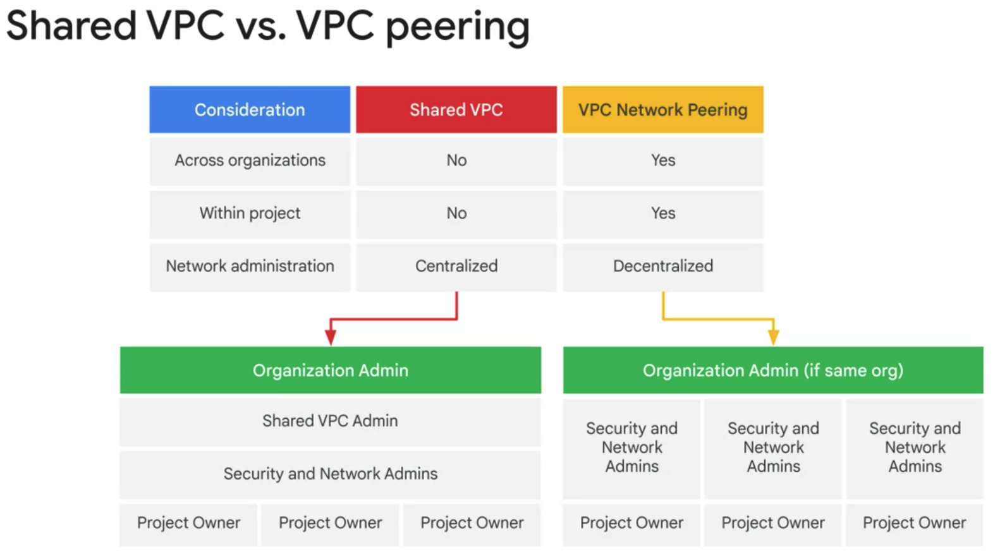
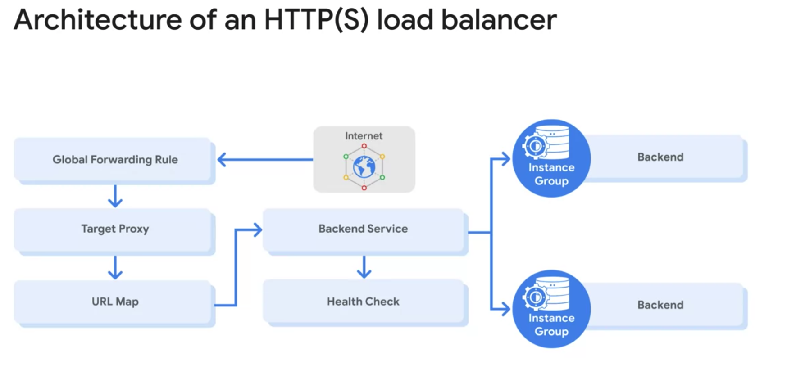
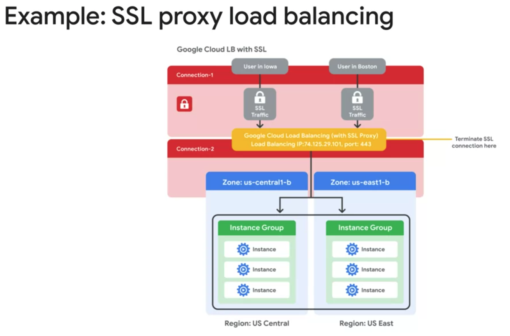
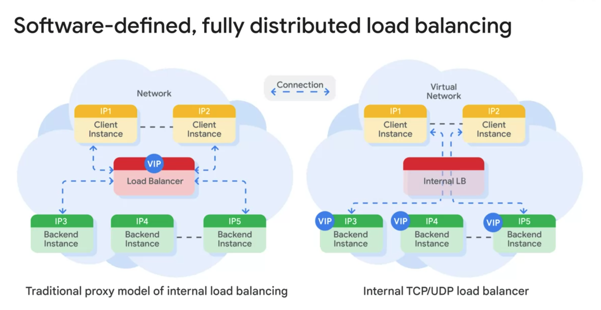
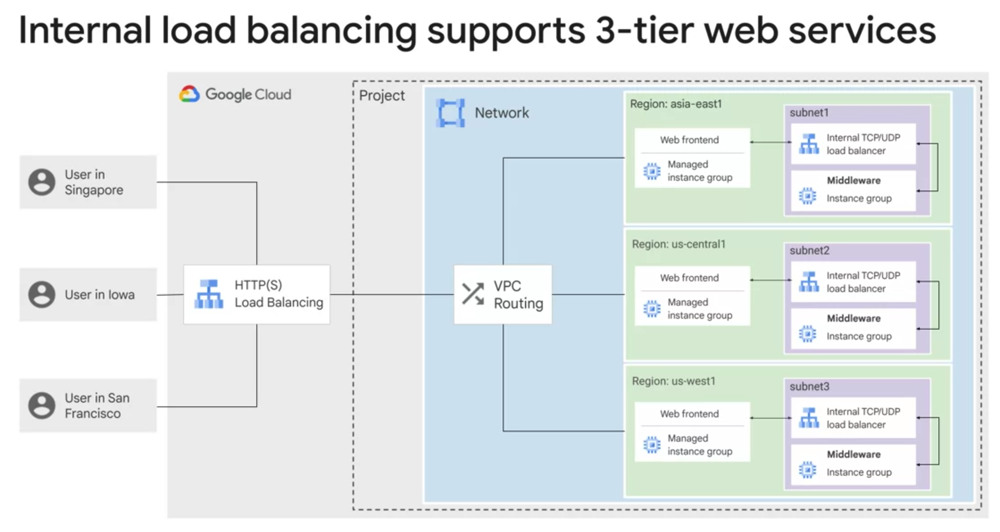
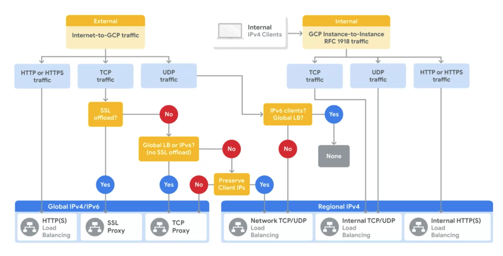
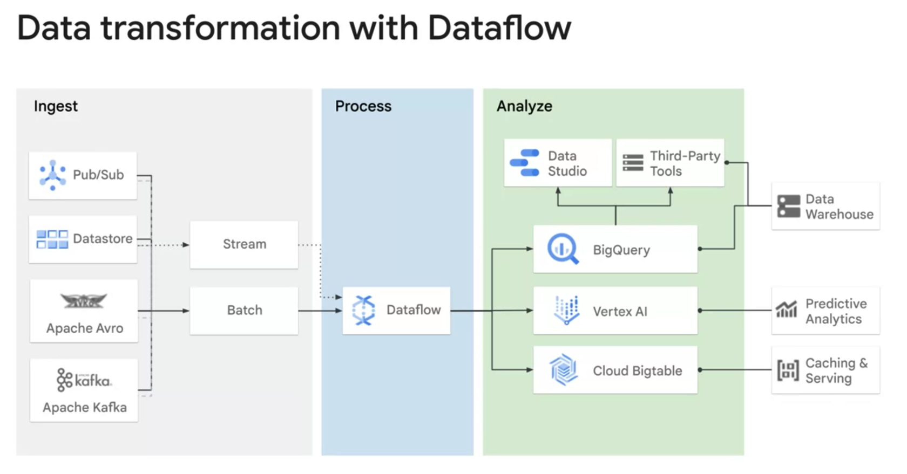

Interconnecting Networks:
=========================

Cloud VPN:
----------

-> Cloud VPN securely connects your on-premises network to your Google cloud VPC network
-> The entire network network is encrypted in one VPN Gateway and decrypted in another VPN gateway
Supports the below:
* Site-to-Site VPN
* Static routes
* Dynamic routes (Cloud Router)
* IKEv1 and IKEv2 Ciphers

HA VPN (High Availability VPN):
-------------------------------
-> Provides 99.99% service availability

-> To Obtain this High availability we must properly configure the two HA VPN tunnels
-> It must use the Dynamic BGP routing

Dynamic routung with Cloud routing:
-----------------------------------
-> Cloud router uses the BGP routing for the cloud VPN to achieve the dynamic routing

Note: BGP explanation:
-----------------------
BGP(Border Gateway Protocol) is a routing protocol used on the Internet to exchange routing information between different networks, allowing them to connect and communicate with each other. It determines the best paths for sending data between networks based on various attributes and helps ensure efficient and reliable routing.

Dedicated Interconnect:
-----------------------
-> Connecting over the co-location facility where the GCP Peering edge and On-premise router will connect
-> Enable the BGP session over this interconnect between the GCP cloud router and On premise router
-> In order to enable the dedicated interconnect, our location must support the Google's Colocation facility
-> If our location is no where near to this colocation facility, that's when we need to think about the partner interconnect

Partner interconnect:
---------------------
-> It connects our on-prem network to GCP VPC network through a Supported service provider
-> In order to use we need to work the supported Service provider to connect our VPC network to on prem network
-> It can be configured 99.99% uptime SLA

Cloud Peering:
--------------
1. Direct Peering 
     Direct Peering, also known as public peering or Internet peering, involves the direct exchange of traffic between two networks at an Internet Exchange Point (IXP) or a peering location. It enables networks to exchange data directly without traversing third-party networks or service providers. Direct Peering is typically used by Internet Service Providers (ISPs), content providers, and large networks to improve network performance, reduce latency, and lower transit costs. It allows for efficient and optimized data routing between networks.

2. Carrier peering
     Carrier peering in the context of Google Cloud Platform (GCP) refers to the direct interconnection between telecommunication carriers or Internet Service Providers (ISPs) and GCP's network infrastructure. It allows these carriers or ISPs to establish direct peering connections with GCP's global network.
     
How to Choose the network between these options?
================================================

Connect your infra to the cloud? 
If its workspace Or G-Suite services (Google APIs, YouTube APIs), Choose Direct Peering or Carrier Peering

Extend the reach of your network to Google cloud?
Choose Interconnect

Meet at one of Google's colocation facilities?
No - Modest bandwidth, short duration, trails
Yes - Own encryption mechanisms for sensitive traffic

Shared VPC:
-----------
-> Sharing the VPC network across the several GCP projects
-> Enable the VPC peering and private communications across the projects  
-> When we use shared VPC, designate a project as a Host project and attach one or more service projects

Summary:
=======
In below 5 ways we can connect our On-prem to GCP:

1. Cloud VPN
2. Dedicated interconnect
3. Direct peering
4. Carrier Peering
5. Partner interconnect 

Load Balancing and Autoscaling
===============================

Cloud Load Balancing is a fully distributed software defined managed service. It's not an instance or device. We dont need to manage a physical infrastructure to manage the Load balancing.

Two types of Load balancers offered by GCP:

Global:
It can be used when our instance or users are Globally distributed.

-> HTTP(s)
-> SSL Proxy
-> TCP Proxy

Regional:
These are internal network load balancer. It distributes the traffic to backend instances which are located in a single region.

-> Internal TCP/UDP
-> Network TCP/UDP
-> Internal HTTP(s)

HTTP(s) Load balancing:
=======================

-> It acts a Layer-7 Application load balancer
-> HTTP uses port 80 or 8080
-> Requests are passed to closest instance groups. If there is no closest instance groups requests are passed to next available instance groups.
-> Cliebt SSL session terminates at the load balancer
-> It uses the round-robin algorithm to distribute the traffic among the backend instances
-> Its a Layer-7 Load balancer 

General Overview About HTTP(s) Load balancing:
===============================================
Google Cloud HTTP(S) load balancing is implemented at the edge of Google's network in Google's points of presence (POP) around the world. User traffic directed to an HTTP(S) load balancer enters the POP closest to the user and is then load-balanced over Google's global network to the closest backend that has sufficient available capacity.

SSL Proxy Load balancing:
=========================

-> Suitable Global load balancing for encrypted, not http traffic
-> Terminates the SSL session at the load balancing layer

Important TCP Vs HTTP Vs UDP:
==============================

* In summary, HTTP is an application-level protocol primarily used for web browsing, while TCP is a lower-level transport protocol responsible for reliable data delivery. TCP provides the underlying infrastructure for HTTP to function effectively and ensure the integrity of data transmission.

* In summary, UDP is a connectionless, lightweight protocol that offers fast transmission but does not guarantee delivery or order of packets. It is suitable for applications where speed is prioritized over reliability, and the application itself handles any necessary error checking and packet management.

TCP Proxy load balancing:
=========================

-> Suitable for un encrypted Global load balancing, not http traffic

NEG (Network Endpoint Group):
=============================
Configuration object that sepcifies a group of backend endpoints or services.
-> Common use case for this service is containers

Network load balancing:
======================
-> Regional, non-proxied load balancer
-> All traffic is passed to the load balancer instead of proxied

Internal Load balancing:
========================

-> Regional, private load balancing
-> It's a software defined, fully distributed load balancing
-> In the above diagram, Google cloud directly sends the traffic from client to backend instances instead of establising 
   two connections like the traditional model.

IMPORTANT Note about RFC1918 IP addresses:
==========================================

What is RFC 1918?

RFC 1918 defines private IP addresses that are reserved for use within private networks. These IP addresses are not routable on the public internet. In short, RFC 1918 IP addresses are a set of addresses that are commonly used for internal network configurations, allowing organizations to create their own private networks without conflicting with publicly routable IP addresses.

Who defines these rules? What are the IP ranges?

The ranges for RFC 1918 IP addresses are defined by the Internet Engineering Task Force (IETF), an organization that develops and promotes internet standards. The specific ranges defined by RFC 1918 are as follows:

10.0.0.0 to 10.255.255.255 (10.0.0.0/8)
172.16.0.0 to 172.31.255.255 (172.16.0.0/12)
192.168.0.0 to 192.168.255.255 (192.168.0.0/16)
These address ranges are reserved for private use and should not be used for public internet routing. They are commonly employed in local area networks (LANs), home networks, and within organizations to establish private network environments.

Expansion of RFC ?

RFC stands for "Request for Comments." It is a series of documents that describe various aspects of the Internet, including protocols, procedures, guidelines, and organizational information. RFCs are developed and published by the Internet Engineering Task Force (IETF) to facilitate the open discussion and consensus-building process for internet standards.

The RFC process allows individuals and organizations to propose new ideas, protocols, or modifications to existing standards. These proposals undergo review and discussion within the technical community before being accepted, revised, or rejected. RFCs are assigned unique numbers and are considered the official documents that define internet standards and protocols.

RFCs cover a wide range of topics related to networking, internet protocols, security, programming languages, and more. They serve as a fundamental resource for engineers, researchers, and developers involved in the design, implementation, and maintenance of internet technologies.

It's worth noting that while the name "Request for Comments" may imply a draft or provisional status, many RFCs represent stable and widely adopted standards in the networking field.

Who is that Internet Engineering Task Force(IETF)?

The Internet Engineering Task Force (IETF) is an open, international community of network designers, operators, vendors, and researchers responsible for the development and promotion of internet standards. It is a voluntary organization that operates through a consensus-based approach.

The IETF's primary goal is to ensure the smooth operation and evolution of the internet by fostering the development of high-quality, relevant, and interoperable standards. These standards cover a wide range of areas, including protocols, procedures, security, network management, and more.

The IETF conducts its work through working groups, which focus on specific topics or areas of interest. These working groups consist of volunteers from around the world who collaborate online, participate in mailing lists, attend meetings, and contribute to the development of internet standards.

The IETF is governed by the Internet Society (ISOC), a non-profit organization that provides financial and legal support to the IETF's activities. The Internet Architecture Board (IAB) serves as an advisory body to the IETF, providing guidance on technical and architectural matters.

Overall, the IETF plays a crucial role in shaping the future of the internet by developing and maintaining the standards that enable global connectivity, interoperability, and innovation.

How do you choose a Load balancers?

Summary of Load balancers:

=========================================================================================================================

Module 2 (Infrastructure As a Code):
=====================================

Terraform:
----------
-> It uses the Hashicorp Configuration Language (HCL)
-> Terraform is already installed in Cloud Shell

terraform init --> Command should run where the main.tf file is present. It downloads the dependencies based the provider we mentioned in the main.tf file. It downloads the all the necessary plugins and store in the sub-folder.

terraform plan --> It's a refresh command goes through the configuration files and decide what actions are necessary to achieve the desired state.

terraform apply --> It will create the infrastructure defined in the configuration file. Once this command completed 
we will able to see the infra created in the GCP.

Cloud Dataflow:
===============

Cloud Data prep:
================

-> To visually explore, clean, and prepare date for analysis and ML

Cloud Dataproc:
===============

-> Dataproc is a service for running Apache spark and Apache Hadoop clusters

