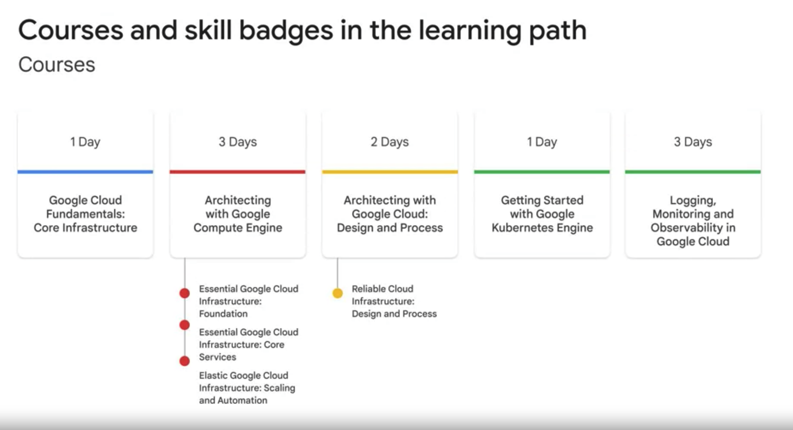

Course Agenda:

1. Introduction
2. Designing and Planning a Cloud Solution Architecture
3. Managing and provisioning a solution infrastructure
4. Designing for security and Compliance
5. Analyzing and Optimizing Techinical and Business Processes
6. Managing Implementation and Ensuring solution and operations reliability
7. Case study preparation and your next steps

