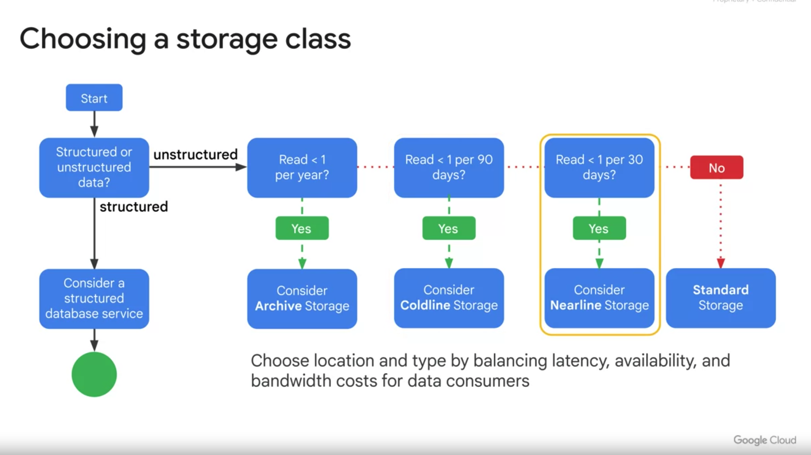

Course Agenda:

1. Introduction
2. Designing and Planning a Cloud Solution Architecture
3. Managing and provisioning a solution infrastructure
4. Designing for security and Compliance
5. Analyzing and Optimizing Techinical and Business Processes
6. Managing Implementation and Ensuring solution and operations reliability
7. Case study preparation and your next steps

Cloud Storage:
===============

What is VPC Service controls?

Using this perimeter we can lock down our GCP services similar to how firewall protects our servers.

Load Balancing:
=================
Global and Regional Load balancers:

Global:
-> External HTTP(s) Load Balancing
-> External SSL Proxy Load balancing
-> External TCP Proxy Load balancing

Regional Load Balancers:
=========================
Def: Regional load balancers are External/Internal load balancers

-> Regional External HTTP(s) Load Balancing
-> Internal HTTP(s) Load Balancing --> It's proxy based internal Layer-7 Load balancer
-> Internal TCP Proxy Load Balancing
   * Regional, private load balancer
   * RFC 1918 IP addresses
   * Its a software defined fully distributed LOad balancer
-> Internal TCP/UDP Load Balancing
-> External TCP/UDP Network Load balancing
-> External TCP Proxy load balancing

Different Deployment strategies:
================================

Blue/Green:
-----------
-> Only one version is live at a time
-> Once the green (new version) deployed and tested, when it is stable traffic will be routed.
-> There is no downtime
-> Blue version is kept for sometime for possible rollback.

Canary deployment:
------------------
-> Deploy the new version, next to the old one
-> Subset of production traffic will be sent to this new version to evaluate its performance
-> Benefit of this pattern is that you are testing it against the production traffic

A/B testing:
------------
-> It is closer to the canary testing
-> Measure the effectiveness of proposed changes
-> Canary is concerned with production performance where as A/B is more concerned with the new features.

Cloud Armor Overview: (Content from YouTube: https://www.youtube.com/watch?v=oXJ68Sa8jfU)
=====================

-> Mitigate the volumetric DDoS aatcks - Across all the global load balancers
-> WAF - to help defend against application layer attacks
-> Filter the traffic based on IP, Geo and custom matcg parameters
-> Telemetry - Cloud logging, Cloud Monitoring and Security command Center

DDoS Attack:

Imagine you're trying to visit a website, but instead of just you, a huge crowd of people all try to visit the website at the same time. This overwhelming number of visitors can make the website so busy that it can't handle everyone's requests, causing it to slow down or even crash.

A Distributed Denial of Service (DDoS) attack is like that crowd of people, but it's not actual people. Instead, it's a bunch of computers or devices working together to flood a website or online service with so much traffic that it becomes really hard or even impossible for that website to work properly. It's like making the website feel sick because it's being bombarded with too much information all at once.

Storage and Databases services:
===============================

Cloud Storage classes:
======================

Standard
--> Hot data and stored for only brief periods of time like data intensive computations
--> No Min storage time
--> Retrival cost none
--> SLA is 99.95%(Multi)
--> SLA is 99.90% for regional

Nearline:
--> Infrequently accessed data like data backup
--> long-tail multinedai content and data archiving
-> Min Sto: 30days
-> Cost: 0.01 per GB

Coldline:
--> Infrequently accessed data.
--> Min sto: 90days

Archive:
--> Data archiving, online backup and DR
--> Min Sto: 365 days

How do you choose the storage class?

File Store:
===========
--> Fully managed network attached storage (NAS) for compute engines and GKE instances
