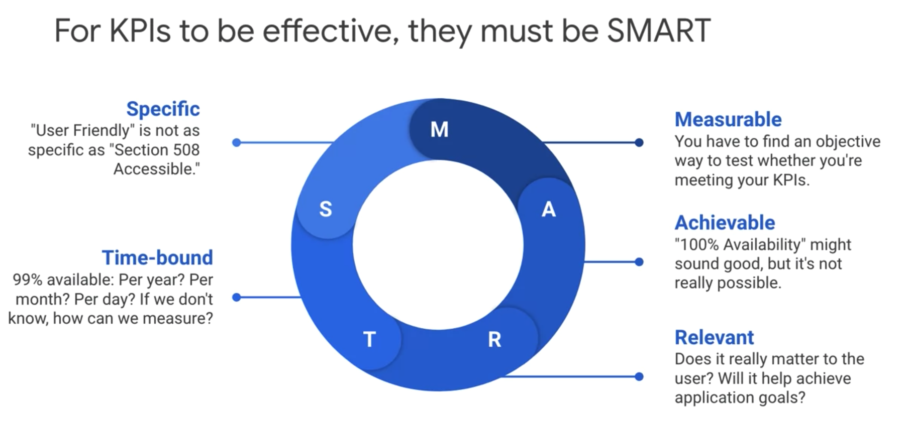
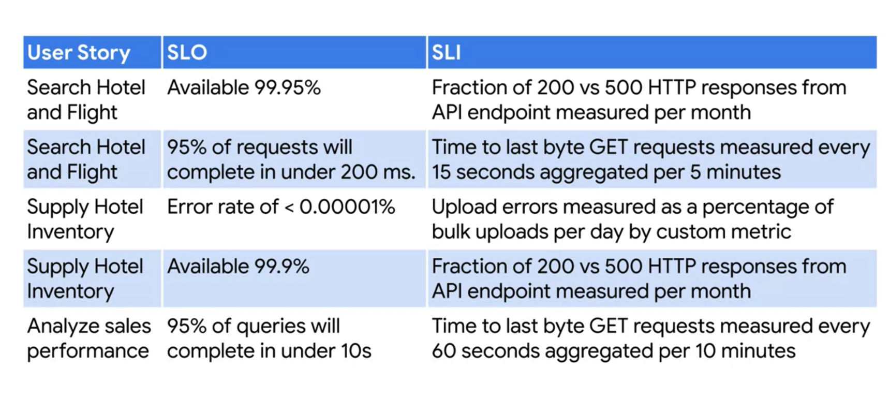
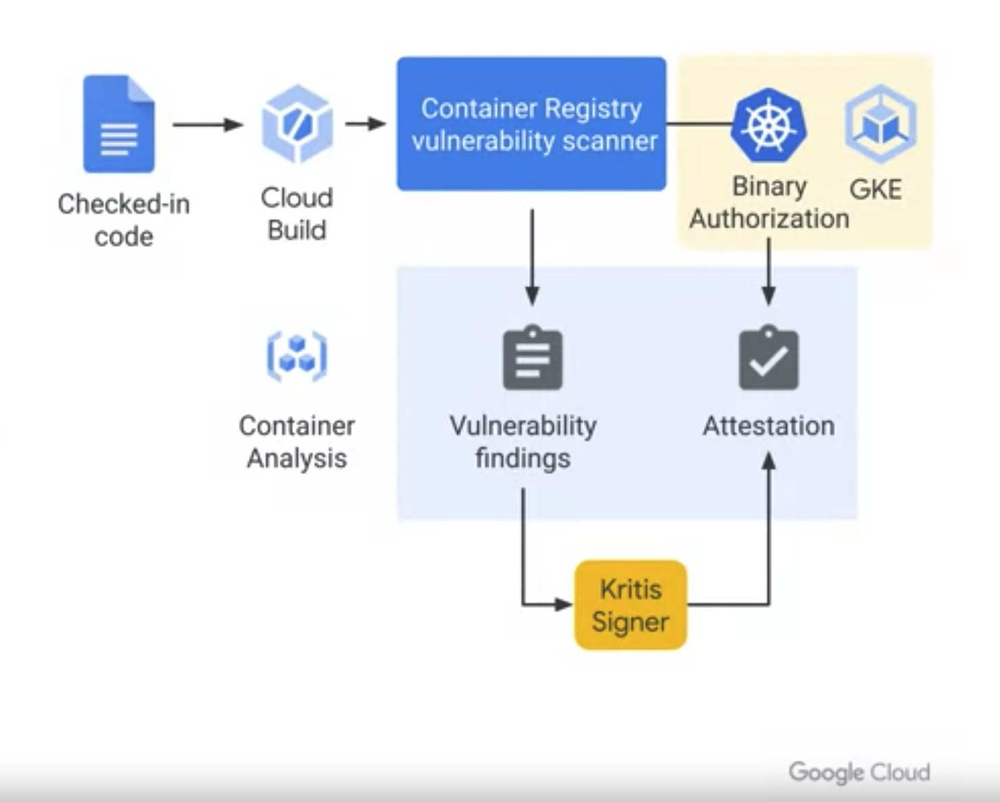
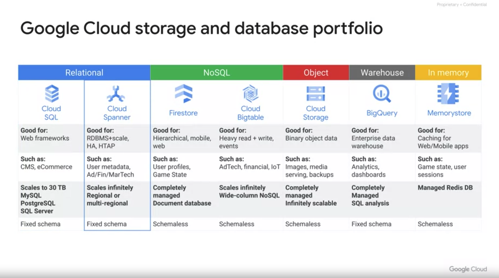
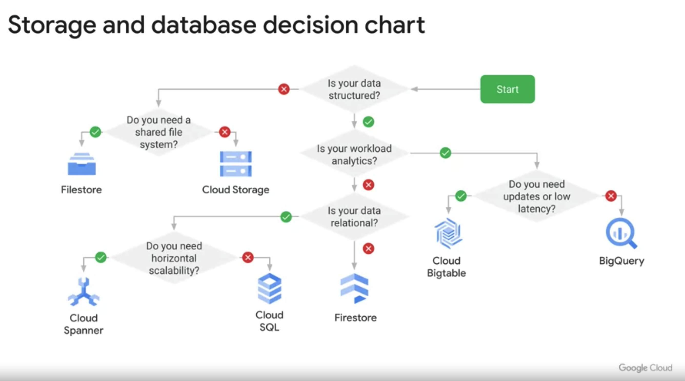
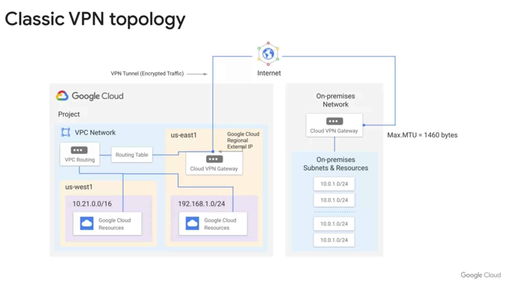
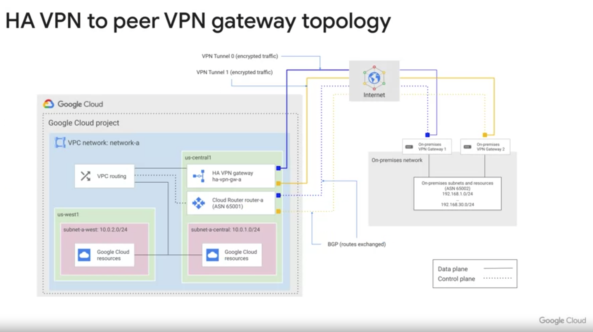
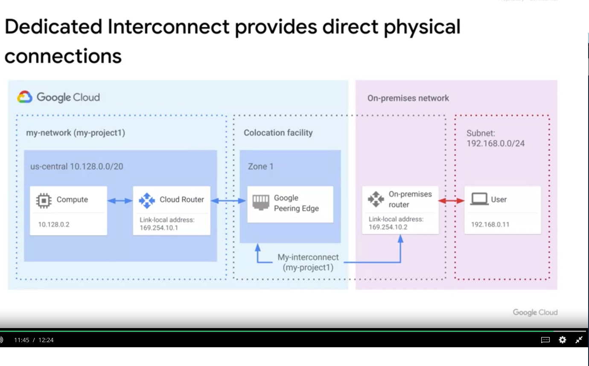
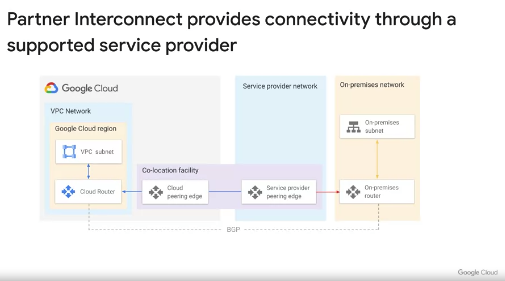

Requirements, Analysis and Design:
===================================

Useful questions that cloud Architect can be asked to design the system properly.

Who - Who are the users?
      Who are the developers?
      Who are the stakeholder?
What - What does the system do?
       What are the main features?
Why - Why is the system needed?
When - When do the users need and/or want the solution?
       When can the developers be done?
How - How will the system work?
       How many users will be there?
       How much data will be there?
       
User Story:
===========

User stories describe a feature from the  user's point of view.

Key Performance Indicators (KPI):
=================================

-> Business decision makers totally rely on this KPIs.
-> Two types of KPIs are there.

1. Business KPIs
 --> Business KPIs includes the Return on investment (ROI)
 --> Earnings before interest and taxes (EBIT)
 --> Employee turnover
 --> Customer churn
2. Software KPIs
 --> How effective the software is through, Page views
 --> User registrations
 --> Clickthroughs
 --> Checkouts

 Goal Vs KPI:
 ============

 Goal --> Outcome or result you want to achieve
 KPI ---> Metrics which indicates whether we are on track to achieve

 Goal and KPIs are different, Goal is outcome of your project where as KPI is metric values to achieve the goal.
 -> Monitoring the KPIs against the goal is important to achieve our goals.

 KPIs must be:

 -> S - More specific, it should not be generic
 -> M - Measurable, it must be measurable
 -> A - Achievable, For an ex: 100% Availability for a webiste wont be achievable
 -> R - Relevant, Need to think whether its really matter to the end-user and will it help to achieve the goal.
 -> T - Time bound, 99% available per year, per month, per day. 

 

Quantitative requirements can be expressed in terms of SLIs, SLOs and SLAs:
============================================================================

SLI - Is a measurable attribute of a service. Such as latency of service, throughput.
--> SLI must be time - bounded and measurable.
--> fast response time is not measurable one, instead of HTTP GET response should be below 400ms is measurable
--> Highly available is not a measurable one, instead of percentage of successful overall requests is measurable.

SLO - Its a targeted range of values measured by SLIs ex: Average latency of a service should be less than 100ms.
SLA - Its most restrictive version of SLOs. A contract between the customers and the service providers. Providing the    compensation if the service doesn't meet the specific expectations.

 

 ========================================================================================================================

 Microservices:
 ==============

 Twelve factor App:
 ==================

 * Maximize the portability
 * Deploy to the cloud
 * Enable continuous deployment
 * Scale easily

 1st Factor(Codebase) --> Code base should be tracked in Version control system.
 2nd Factor(dependencies) --> Declare the dependencies in the codebase, such as the package manager like Maven, Pip, NPM.
 3rd Factor(Configuration) --> Configs. These are environment related configs such as tokens, db username, passwords, strings,        endpoints etc.. This should not be stored in source code.
 4th Factor(Backing services) --> Backing services, Treat backing services as a attached resources. Such Databases, caches, queues and other services are accessed via URLs. It can be easily swapped to implement the other one.
 5th Factor(Build, release and run) --> Build, release and run. 
 6th Factor(Processes) --> Processes. Execute the app as one or more stateless processes.
 7th Factor(Port binding) --> Export the services via port binding
 8th Factor(Concurrency) --> Scale out. Apps are running self-contained and run in seprate processes, they scale easily by adding instances
 9th Factor(Disposability) --> Easy disposability, for an example if an instance is not needed, you should be able to turn it off with no side effects.
10th Factor(Dev/prod parity) --> Keep the dev, prod environment as similar as possible
11th Factor(Logs) --> Write the log messages to standard output and aggregate all logs to a single source.
12th Factor(Admin processes) --> Admin processes. Run the admin/management tasks as one off processes. 

REST Architecture supports loose coupling:
===========================================

REST Stands for - Representational State Transfer
-> Protocol independent 
-> Most commonly used is HTTP
-> other possible is gRPC (Supports streaming)

-> Service endpoints which are supporting REST is RESTful

-> Passing representations between services is done using standard text-bases formats which is json, HTML, XML and csv.

Binary Authorization:
======================
-> It allows you to enforce deploying only trusted containers in GKE.
-> Enable the binary authorization on the GKE cluster

Google cloud - Managed storage an DB portfolio:
================================================

relational - CloudSQL, Cloud Spanner
noSQL - Firestore, cloud Bigtable
Object - Cloud storage
Warehouse - Bigquery
In Memory - memory store

Google Networks:

-> VPC networks are global
-> When creating the VPC the automode will create subnets for in the each regions
-> custom mode will allow us to create the subnets with the preferred region
-> Resources across the region can communicate with its internal IPs under the same VPC

Connecting Networks:
=====================

-> VPC Peering - Connecting two VPC networks for an example: connecting two VPC networks from 2 different organizations
               - It allows the private RFC 1918 connectivity across the 2 VPC's

-> Cloud VPN - Connects our on-prem network to Google VPC network using IPSec VPN tunnels.

Classic VPN topology:
======================

HA VPN topology:
================

-> In order to use the dynamic routing, we need to configure the cloud router.

Cloud Interconnect:
====================

Dedicated interconnect:

Partner interconnect:

